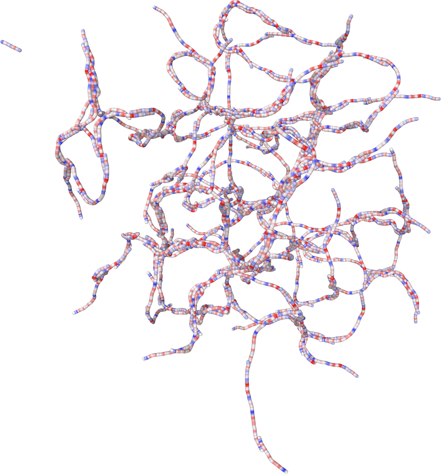

<!--
*** Thanks for checking out the Best-README-Template. If you have a suggestion
*** that would make this better, please fork the repo and create a pull request
*** or simply open an issue with the tag "enhancement".
*** Thanks again! Now go create something AMAZING! :D
***
***
***
*** To avoid retyping too much info. Do a search and replace for the following:
*** Saric-Group, analytical_collagen, twitter_handle, email, Analytical Collagen, This project is designed around the analysis of collagen and collagen-like molecules with a focus on the assembly process and structure of collagen fibrils.
-->


<!-- PROJECT SHIELDS -->
<!--
*** I'm using markdown "reference style" links for readability.
*** Reference links are enclosed in brackets [ ] instead of parentheses ( ).
*** See the bottom of this document for the declaration of the reference variables
*** for contributors-url, forks-url, etc. This is an optional, concise syntax you may use.
*** https://www.markdownguide.org/basic-syntax/#reference-style-links
-->
[![Contributors][contributors-shield]][contributors-url]
[![Forks][forks-shield]][forks-url]
[![Stargazers][stars-shield]][stars-url]
[![Issues][issues-shield]][issues-url]
[![MIT License][license-shield]][license-url]
[![LinkedIn][linkedin-shield]][linkedin-url]


<!-- PROJECT LOGO -->
<br />
<p align="center">
  <a href="https://github.com/Saric-Group/analytical_collagen">
    
  </a>

  <h3 align="center">Analytical Collagen</h3>

  <p align="center">
    This project is designed around the analysis of collagen and collagen-like molecules with a focus on the assembly process and structure of collagen fibrils.
    <br />
    <a href="https://github.com/Saric-Group/analytical_collagen"><strong>Explore the docs »</strong></a>
    <br />
    <br />
    <a href="https://github.com/Saric-Group/analytical_collagen">View Demo</a>
    ·
    <a href="https://github.com/Saric-Group/analytical_collagen/issues">Report Bug</a>
    ·
    <a href="https://github.com/Saric-Group/analytical_collagen/issues">Request Feature</a>
  </p>
</p>


<!-- TABLE OF CONTENTS -->
<details open="open">
  <summary><h2 style="display: inline-block">Table of Contents</h2></summary>
  <ol>
    <li>
      <a href="#about-the-project">About The Project</a>
      <ul>
        <li><a href="#built-with">Built With</a></li>
      </ul>
    </li>
    <li>
      <a href="#getting-started">Getting Started</a>
      <ul>
        <li><a href="#prerequisites">Prerequisites</a></li>
        <li><a href="#installation">Installation</a></li>
      </ul>
    </li>
    <li><a href="#usage">Usage</a></li>
    <li><a href="#roadmap">Roadmap</a></li>
    <li><a href="#contributing">Contributing</a></li>
    <li><a href="#license">License</a></li>
    <li><a href="#contact">Contact</a></li>
    <li><a href="#acknowledgements">Acknowledgements</a></li>
  </ol>
</details>


<!-- ABOUT THE PROJECT -->
## About The Project

<!-- [![Product Name Screen Shot][product-screenshot]](https://example.com) -->

Collagen type I molecules generally assemble into fibrils and by doing so, they create a perdiodic pattern, the D-periodicity. In this project, the goal is to find out what the main drivers behind this robust and far spread assembly phenomenon are and to analyze the process.

Along the road, this analysis code will adjust to the new insights we gain.

So far the code mainly provides
* the calculation of minimum energy configurations for a multilayer configuration of collagen molecules;
* the creation of LAMMPS files to run molecular dynamics simulations.


### Built With

* []()
* []()
* []()


<!-- GETTING STARTED -->
## Getting Started

To get a local copy up and running follow these simple steps.

### Prerequisites
<!--
This is an example of how to list things you need to use the software and how to install them.
* npm
  ```sh
  npm install npm@latest -g
  ```
-->
### Installation

1. Clone the repo
   ```sh
   git clone https://github.com/Saric-Group/analytical_collagen.git
   ```
2. Run
   ```sh
   make
   ```


<!-- USAGE EXAMPLES -->
## Usage

The main options and parameters can be accessed and controlled via the config file.

### Preparing and running LAMMPS simulations

The code conveniently automizes almost all necessary steps to set up and run molecular dynamics simulations on a remote cluster using the LAMMPS software package. Whether you want to simulate a single set of parameters or a broad range of parameters, it is all taken care of. Currently, we support the variation of the Lennard-Jones and Coloumb-Debye interaction strength as well as the rigidity parameter for the atomar angles. More options to come!

To do so, follow below steps:

1. Set `MDoutput` flag in the config file.
2. Set local folder path `mdoutput = /path/to/folder/` to create files there.
3. Adjust key parameters (such as the number of molecules to be simulated).
4. Run
   ```sh
   ./main --config ./your.config -md_s -md_t
   ```
   to create the necessary scripts via `-md_s` and the topology file via `-md_t`.
5. Navigate to the folder and run
   ```sh
   ./sim.sh -c
   ```
   to create the LAMMPS output folders containing the LAMMPS input files.
6. Copy all files to a remote cluster and run
   ```sh
   ./sim.sh -r
   ```
   to queue the simulations.

Depending on your queuing system, you might need to adjust the file *run.qsub*. When the simulations are done, you will find LAMMPS xyz output files for each simulation in the corresponding folder. Transfer them back to your local machine to analyze or manipulate them.


### Config options

The config file is used to control all major aspects and parameters of the program. To use a config file, call the program via
   ```sh
   ./main --config /path/to/config/file.config
   ```
The syntax for the config file is as follows:

* `var` for setting flags.
* `var = number` for whole numbers.
* `var = value` for floating point numbers.
* `var = string` for string variables such as path definitions.

By default, flags are not set.

Furthermore, the config file is separated into logical areas that group together variables that are mostly used together.

The default config file provided in the repository contains little information about the options. Further details are given below.

#### General

This is a necessary information for finding the program when running the LAMMPS creation scripts.

* Path to the folder where the main program is located.
  ```sh
  mainPath = /path/to/md/folder/
  ```
  Command line option: `-mp /path/to/md/folder/`.

#### Flags

Mostly used to activate certain parts of the program.

* Toggles output of most information to the console.
  ```sh
  consoleOutput
  ```
  Command line option: `-co`.

* Toggles printing of help to console.
  ```sh
  help
  ```
  Command line option: `-h`.

* Toggles measuring of run time and printing it to the console at the end of run time.
  ```sh
  measureTime
  ```
  Command line option: `-time`.

#### Input / output

* Input filepath for the collagen molecule configuration. Provided files must have the format of files given in the *molecule* folder. They can either provide the charges of each atom in the molecule or the type of amino acid, which each atom represents.
  ```sh
  input = /path/to/molecule/file
  ```
  Command line option: `-i /path/to/file`.

* Output filepath for general output. This path is used for example for the output of the data generated by *Original output*.
  ```sh
  output = /path/to/output/file
  ```
  Command line option: `-o /path/to/file`.

* Filepath to the output folder for MD / LAMMPS files.
  ```sh
  mdoutput = /path/to/md/folder/
  ```
  Command line option: `-mdo /path/to/folder/`.

#### General molecule parameter

The parameters in this section control the general shape of the molecule and the fibril model. They are mostly used for all other parts of the program. Also, molecule and atom information printing to the console can be controlled here.

* Prints information of the form *ID Type Charge* for each atom of the molecule to the console.
  ```sh
  printAtomInfo
  ```
  Command line option: `-pai`.

* Prints information about the molecule to the console.
  ```sh
  printMoleculeInfo
  ```
  Command line option: `-pmi`.

* Sets the diameter of individual atoms in the molecule. This controls the minimum distance that two atoms of two different molecules must have to each other. It does **not** mean that two atoms of the same molecule must have this minimum distance.
  ```sh
  diameter = 1.12
  ```
  Command line option: `-dia 1.12`.

* Sets the interatomic distance, i.e. the distance between two neighboring atoms within one molecule.
  ```sh
  dist = 0.255
  ```
  Command line option: `-d 0.255`.

* Sets the number of interacting molecule layers that are considered when minimizing the energy.
  ```sh
  layers = 2
  ```
  Command line option: `-l 2`.


#### Original output

This is a main function of the code and represents the very first implementation of an energy minimization algorithm that is used to find the minimum energy configuration of collagen molecules arranged in fully interacting layers. The interactions are given by Lennard-Jones and Coulomb-Debye potentials.

* Toggles this part of the program.
  ```sh
  originalOutput
  ```
  Command line option: `-oo`.

* Toggles hash addition to files created in this part of the program.
  ```sh
  chargehash
  ```
  Command line option: `-c`.

* Changes the output format of files created in this part to csv files.
  ```sh
  CSV
  ```
  Command line option: `-csv`.

* Toggles additional output of xyz files containing the molecule coordinates and configurations.
  ```sh
  xyz
  ```
  Command line option: `-x`.

* The strength of the Lennard-Jones potential that is used to mimic hydrophobic interactions can be varied within one run of the program by setting the following options.
  ```sh
  ljmin = 0.01
  ljstepssize = 0.01
  ljsteps = 50
  ```
  Command line options: `-mlj 0.01`, `-sslj 0.01`, `-slj 50`.

* Sets the cutoff distance for the Lennard-Jones potential.
  ```sh
  ljcut = 2.0
  ```
  Command line option: `-clj 2.0`.

* The dielectric constant of the Coulomb-Debye potential that is used to mimic electrostatic interactions can be varied within one run of the program by setting the following options.
  ```sh
  cdmin = 10.0
  cdstepssize = 10.0
  cdsteps = 20
  ```
  Command line options: `-mcd 10.0`, `-sscd 10.0`, `-scd 20`.

* Sets the cutoff distance for the Coulomb-Debye potential.
  ```sh
  cdcut = 2.0
  ```
  Command line option: `-ccd 2.0`.

#### Molecular dynamics and LAMMPS parameters

This is a main function of the code that automizes the creation of topology files, LAMMPS input scripts, and bash scripts to run the simulations on a remote cluster. For usage on a local installation of LAMMPS, some parts of the created scripts need to be adjusted manually. Alternatively, one can entirely skip using the scripts and just use the topology and LAMMPS input files, for instance.

* Toggles this part of the program.
  ```sh
  MDoutput
  ```
  Command line option: `-mdo`.

* Path of LAMMPS mpi installation on the remote cluster.
  ```sh
  MD_lmp_mpi = /your/path/lmp_mpi
  ```
  Command line option: `-md_mpid /path/to/lmp_mpi`.

* Generates bash scripts in the specified `MDoutput` folder.
  ```sh
  MD_script
  ```
  Command line option: `-md_s`.

* Generates topology file in the specified `MDoutput` folder.
  ```sh
  MD_topology
  ```
  Command line option: `-md_t`.

* Generates LAMMPS input scripts in the specified `MDoutput` folder.
  ```sh
  MD_LAMMPS_input
  ```
  Command line option: `-md_li`.

* Sets the walltime in hours for the LAMMPS simulation.
  ```sh
  MD_walltime = 24
  ```
  Command line option: `-md_wt 24`.

* Sets the number of cores used for the LAMMPS simulation.
  ```sh
  MD_cores = 1
  ```
  Command line option: `-md_c 1`.

* Sets the number of molecules per dimension used for the LAMMPS simulation. This means the total number of molecules will be the **cube** of this number, i.e. MD_n^3.
  ```sh
  MD_N = 5
  ```
  Command line option: `-md_N 5`.

* Toggles rigid molecules for the LAMMPS simulation.
  ```sh
  MD_rigid
  ```
  Command line option: `-md_rigid`.

* Sets the angle rigidities for which simulations are run. First value to simulate is given by `-MD_kAngle_start`. Then this value is incremented by `MD_kAngle_inc` until `MD_kAngle_end` is reached. If `MD_kAngle_end < MD_kAngle_start + MD_kAngle_inc`, only `-MD_kAngle_start` will be considered for simulations.
  ```sh
  MD_kAngle_start = 50.0
  MD_kAngle_inc = 50.0
  MD_kAngle_end = 50.0
  ```
  Command line options: `-md_kas 50.0`, `-md_kai 50.0`, `-md_kae 50.0`.

* Sets the dielectric Coulomb-Debye constant for which simulations are run. First value to simulate is given by `-MD_dielectric_start`. Then this value is incremented by `MD_dielectric_inc` until `MD_dielectric_end` is reached. If `MD_dielectric_end < MD_dielectric_start + MD_dielectric_inc`, only `-MD_dielectric_start` will be considered for simulations.
  ```sh
  MD_dielectric_start = 10.0
  MD_dielectric_inc = 10.0
  MD_dielectric_end = 100.0
  ```
  Command line options: `-md_ds 10.0`, `-md_di 10.0`, `-md_de 100.0`.

* Sets the cutoff of the LAMMPS Coulomb-Debye potential.
  ```sh
  MD_CDcutoff = 5.0
  ```
  Command line option: `-md_cdc 5.0`.

* Sets the epsilon Lennard-Jones constant for which simulations are run. First value to simulate is given by `-MD_epsilon_start`. Then this value is incremented by `MD_epsilon_inc` until `MD_epsilon_end` is reached. If `MD_epsilon_end < MD_epsilon_start + MD_epsilon_inc`, only `-MD_epsilon_start` will be considered for simulations.
  ```sh
  MD_epsilon_start = 0.01
  MD_epsilon_inc = 0.01
  MD_epsilon_end = 0.50
  ```
  Command line options: `-md_es 0.01`, `-md_ei 0.01`, `-md_ee 0.50`.

* Sets the cutoff of the LAMMPS Lennard-Jones potential.
  ```sh
  MD_LJcutoff = 5.0
  ```
  Command line option: `-md_ljc 5.0`.

* Sets the timestep of the LAMMPS simulation.
  ```sh
  MD_timestep = 0.002
  ```
  Command line option: `-md_ts 0.002`.

* Sets the runtime of the LAMMPS simulation.
  ```sh
  MD_runtime = 6000001
  ```
  Command line option: `-md_rt 6000001`.

#### Developmental part

* This toggles the developmental part of the program. Can be used when manipulating the source code manually in order to not affect the rest of the program.
  ```sh
  development
  ```
  Command line option: `-dev`.


<!--
Use this space to show useful examples of how a project can be used. Additional screenshots, code examples and demos work well in this space. You may also link to more resources.

_For more examples, please refer to the [Documentation](https://example.com)_
-->


<!-- ROADMAP -->
## Roadmap

See the [open issues](https://github.com/Saric-Group/analytical_collagen/issues) for a list of proposed features (and known issues).


<!-- CONTRIBUTING -->
## Contributing

Contributions are what make the open source community such an amazing place to learn, inspire, and create. Any contributions you make are **greatly appreciated**.

1. Fork the Project
2. Create your Feature Branch (`git checkout -b feature/AmazingFeature`)
3. Commit your Changes (`git commit -m 'Add some AmazingFeature'`)
4. Push to the Branch (`git push origin feature/AmazingFeature`)
5. Open a Pull Request


<!-- LICENSE -->
## License
<!--
Distributed under the MIT License. See `LICENSE` for more information.
-->


<!-- CONTACT -->
## Contact

Kevin - [@vkevinqt](https://twitter.com/vkevinqt) - ucapkkl@ucl.ac.uk

Project Link: [https://github.com/Saric-Group/analytical_collagen](https://github.com/Saric-Group/analytical_collagen)


<!-- ACKNOWLEDGEMENTS --><!--
## Acknowledgements

* []()
* []()
* []()
-->


<!-- MARKDOWN LINKS & IMAGES -->
<!-- https://www.markdownguide.org/basic-syntax/#reference-style-links -->
[contributors-shield]: https://img.shields.io/github/contributors/Saric-Group/analytical_collagen.svg?style=for-the-badge
[contributors-url]: https://github.com/Saric-Group/analytical_collagen/graphs/contributors
[forks-shield]: https://img.shields.io/github/forks/Saric-Group/analytical_collagen.svg?style=for-the-badge
[forks-url]: https://github.com/Saric-Group/analytical_collagen/network/members
[stars-shield]: https://img.shields.io/github/stars/Saric-Group/analytical_collagen.svg?style=for-the-badge
[stars-url]: https://github.com/Saric-Group/analytical_collagen/stargazers
[issues-shield]: https://img.shields.io/github/issues/Saric-Group/analytical_collagen.svg?style=for-the-badge
[issues-url]: https://github.com/Saric-Group/analytical_collagen/issues
[license-shield]: https://img.shields.io/github/license/Saric-Group/analytical_collagen.svg?style=for-the-badge
[license-url]: https://github.com/Saric-Group/analytical_collagen/blob/master/LICENSE.txt
[linkedin-shield]: https://img.shields.io/badge/-LinkedIn-black.svg?style=for-the-badge&logo=linkedin&colorB=555
[linkedin-url]: https://linkedin.com/in/Saric-Group
